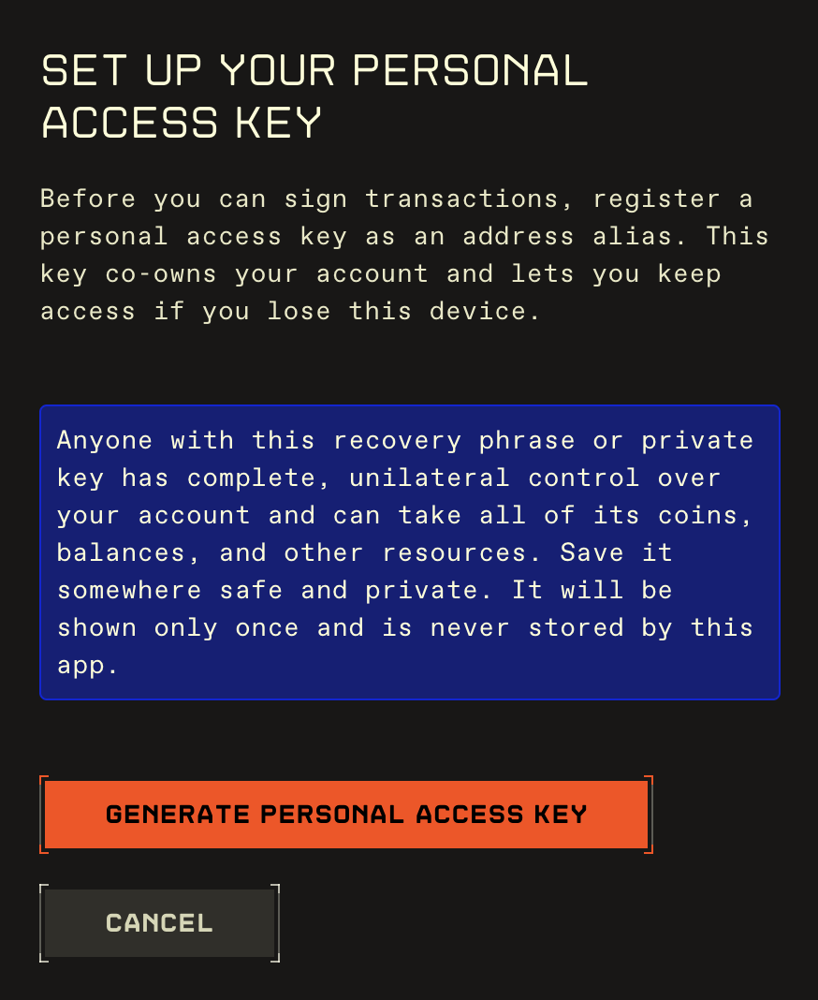

# Address Aliases & Recovery

EVE Vault uses **address aliases** to provide account recovery. Before you can send tokens or sign transactions, you must register a **personal access key** as an address alias. This page explains what an alias is, why the personal access key matters, and how to set it up and manage it.

> **Read this carefully.** An address alias is a **co-owner** of your account with full, unilateral control. Anyone who controls an alias can move all of your coins and assets. Treat alias changes with extreme caution.

---

## What an address alias is

An address alias is an on-chain authorization attached to your Sui address. It designates **which keys are allowed to sign transactions for that address**. Each alias is effectively a **co-owner**: it has complete, unilateral control and can take all of the account's coins, balances, and other resources.

- Aliasing must be **enabled** once (this creates an on-chain aliases object owned by your account).
- Your account can have up to **8** aliases.
- Your own address always appears in the list, labeled **(This address)**, and cannot be removed from EVE Vault.

Aliases are not an address book: aliases are authorization keys, not saved recipients.

---

## Why the personal access key exists

EVE Vault accounts are **zkLogin** accounts — the signing key is derived from your EVE Frontier login on the device you're using. That's what makes onboarding seedless and private, but it also means that losing your device or login could mean losing access to the account.

A **personal access key** solves this. You generate a standalone keypair (a 24-word recovery phrase and a private key), register its address as an alias (co-owner) of your account, and store the secret **offline**. If you ever lose access to your zkLogin device or login, that personal access key can still sign for the account.

Because a personal access alias hands full control to a separate key, EVE Vault requires one before it will let you transact. This guarantees every account has a recovery path.

---

## Set up your personal access key

The first time you try to send tokens or sign a transaction, EVE Vault opens the personal access key setup flow if you haven't completed it yet. You can also reach it from the alias management screen.

1. On **Set up your personal access key**, click **Generate personal access key**. EVE Vault creates a fresh keypair **on your device only** — it is never sent to or stored by the app.
2. On the reveal screen, save all three values shown, each with a **Copy** button:
   - **Recovery phrase** (24 words)
   - **Private key**
   - **Alias address**
3. Store them somewhere safe and private (offline). **They are shown only once.**
4. Check **I've saved my recovery phrase and private key somewhere safe**. The **Register personal access alias** button stays disabled until you do.
5. Click **Register personal access alias**, then confirm in the **Register personal access alias?** dialog.

EVE Vault then registers the personal access address as an alias. If aliasing wasn't enabled yet, this runs two on-chain transactions in sequence (enable, then add), so you may approve more than one. On success you'll see **Recovery alias registered**; click **Continue** to return to what you were doing — your original send or signing action can now proceed.

> **Anyone with this recovery phrase or private key has complete control of your account.** Never share it, never enter it into untrusted software, and keep it offline.

### How the requirement is enforced

The check happens when you send or sign. EVE Vault verifies that your account has at least one alias **other than your own address**. Simply enabling aliasing, or having only your own address listed, does **not** satisfy the requirement — you need a registered recovery (or other non-self) alias.

---

## Manage address aliases

<!--  -->

Open **Manage Address Aliases** from the account menu to review and change who can sign for your account.

- If aliasing isn't set up yet, click **Enable address aliasing** first.
- The list shows **Current aliases (N/8)**. Your own address is marked **(This address)** and can't be removed; every other alias has a **Remove** button.
- To add one, enter a Sui address in the **0x… address alias** field and click **Add alias**. **Add alias** is disabled once you reach the maximum of 8.

Validation prevents common mistakes — for example an empty or malformed address, an address that's already an alias, adding beyond the limit of 8, or removing an address that isn't currently an alias. Every add or remove is an on-chain transaction you'll approve, after which the list refreshes.

> Adding an alias grants that address **full control** of your account. Only add addresses you fully trust and control.

---

For what happens when you approve these transactions, see [Signing Transactions](signing-transactions.md). For everyday actions like sending tokens, see [Using Your Wallet](using-your-wallet.md).
