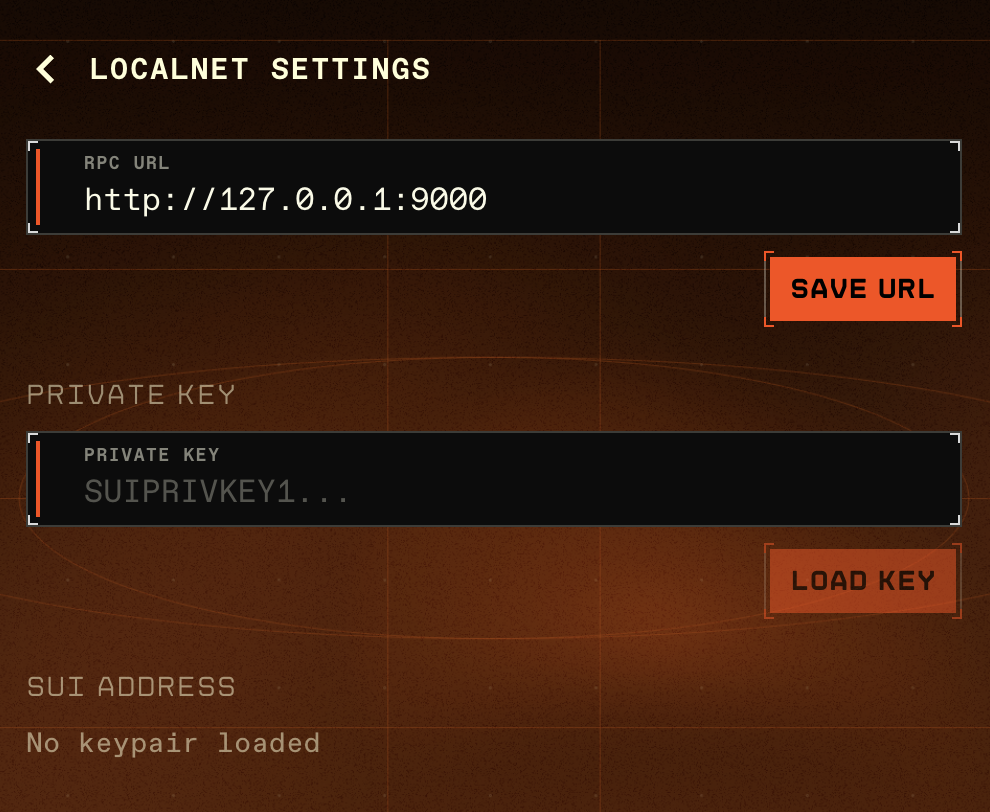

# Developer & Localnet

EVE Vault includes a **dev mode** with tools aimed at builders: pointing the wallet at a local Sui network, loading a raw private key for local testing, and a few utilities for signing test transactions and rotating keys. These are off by default and intended for development only.

---

## Enabling dev mode

Dev mode is a toggle. Turning it on reveals the developer menu items and the localnet settings route.

- **Signed out** — a small floating eye button in the bottom-right corner of the sign-in screen toggles dev mode.
- **Signed in** — open the account menu and flip the **Dev mode** switch at the top.

When dev mode is off, the developer items are hidden and the localnet settings page redirects away.

---

## Localnet settings

With dev mode on, open **Localnet Settings** from the account menu. (Selecting the localnet network without a keypair loaded also brings you here.) The page has three sections.

### RPC URL

Enter your local node's URL — the default is `http://127.0.0.1:9000` — and click **Save URL**. EVE Vault validates the URL and checks connectivity by calling the node (`suix_getLatestSuiSystemState`). The status line shows **Connecting…**, then **Connected** or **Connection failed**.

### Private key

For local testing you can load a raw private key directly:

1. Make sure the vault is unlocked (a key can only be loaded into an unlocked vault).
2. Paste a key in the **Private key** field. It must be in `suiprivkey1...` format.
3. Click **Load Key**. On success you'll see **Key loaded**.

EVE Vault derives a keypair from the key and shows the resulting address in the **SUI ADDRESS** section.

> **Localnet development only.** Never load a private key that controls real assets. This feature exists for testing against a local network — do not use it with mainnet or testnet keys.

### SUI address

This shows the address derived from the loaded key, or **No keypair loaded** if none is set.

---

## Developer utilities

With dev mode on, the account menu gains a few extra actions:

- **Sign and submit test** — builds and submits an empty transaction from your address, to confirm signing works end-to-end. You'll get a **Transaction submitted!** toast and a link to the explorer.
- **Rotate eph key** — rotates the ephemeral signing key (useful when debugging zkLogin session state); details are logged to the console.
- **Faucet test SUI** — opens the current network's faucet in a new tab so you can fund your address with test SUI. Available on networks that have a faucet (e.g. devnet/testnet), not on mainnet.
- **Unlock expires in {m:ss}** — a read-only countdown to the vault's auto-lock.
- **v{version}** — the installed app version.

---

For network switching and everyday actions, see [Using Your Wallet](using-your-wallet.md). For install and sign-in, see [Browser Extension](browser-extension.md).
