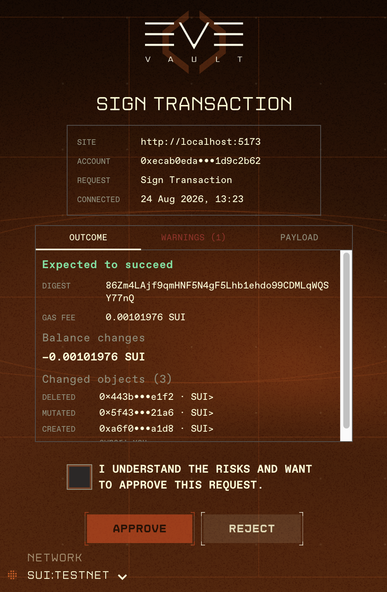
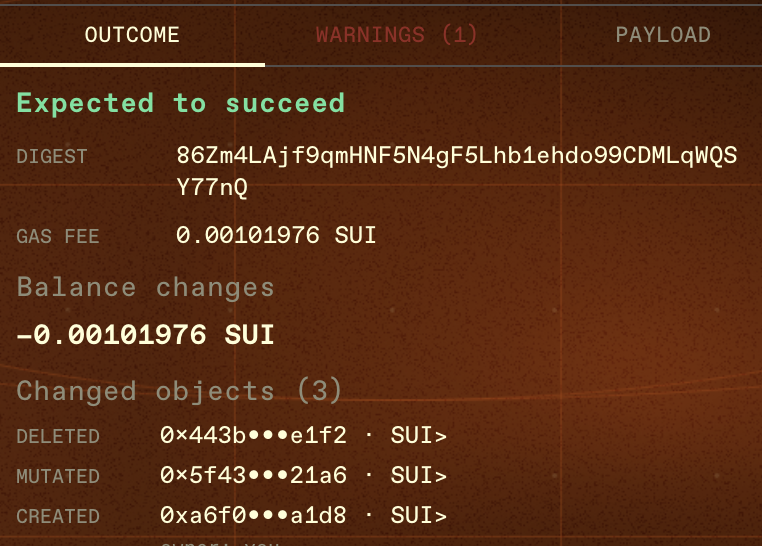

# Signing Transactions

When a dApp asks EVE Vault to sign a message or transaction, the wallet opens a dedicated approval popup. The popup shows who is asking, what they're asking for, a preview of the outcome, and any risks — so you can review before approving. This page explains what you'll see and the different request types.

---

## The signing popup

Every request must pass an auth gate first:

- If the vault is **locked**, you'll be asked for your PIN.
- If you're **not logged in**, you'll see **You need to log in before signing** with **Log In** and **Cancel** buttons.

Once unlocked and authenticated, the request appears with a context panel showing up to four fields:

- **SITE** — the dApp's origin (hover for the full URL).
- **ACCOUNT** — the account that would sign.
- **REQUEST** — the kind of request (see below).
- **CONNECTED** — when the dApp connected, if known.

At the bottom are **Approve** and **Reject**, plus a network selector showing the target chain. When a request carries risk (see below), a checkbox appears that you must tick before **Approve** is enabled.

---

## Outcome, Warnings, and Payload tabs

Transaction requests include a compact set of tabs so you can inspect exactly what you're signing before approving.

### Outcome (simulation)

EVE Vault simulates the transaction (a dry run) and shows the expected result:

- **Expected to succeed** or **Expected to fail** (with the failure reason).
- The transaction **Digest** (when available) and the **Gas fee** in SUI.
- **Balance changes** — signed amounts per token (debits in red, credits in green), or **None**.
- **Changed objects** — each object's kind, id, type, and ownership change (your address is shown as **you**).
- **Events** emitted by the transaction.

If the simulation can't run, you'll see **Could not simulate this transaction. Approve with caution.** A simulated on-chain failure also forces you to acknowledge before approving.

### Warnings (risk review)

EVE Vault statically inspects the transaction and flags notable actions. Higher-severity findings (shown in red) require you to tick the acknowledgement checkbox before approving:

| Severity | Flag | What it means |
|---|---|---|
| High | **Publishes Move code** | Can add new on-chain package code from your account. |
| High | **Upgrades Move code** | Can change package behavior controlled by your account. |
| High | **Transfers objects** | Can move owned objects or tokens out of your account. |
| High | **Modifies address aliases** | Can add or remove [address aliases](address-aliases-and-recovery.md) (co-owners) for your account. |
| High | **Unverified transaction format** | The payload couldn't be decoded for review — a fail-safe against blind-signing. |
| Warning | **Calls Move code** | Review the package, module, and function before approving. |
| Warning | **Builds object vectors** | Can pass multiple objects into a Move call. |
| Warning | **Uses shared objects** | Shared-object calls can change state used by other accounts. |

### Payload

The **Payload** tab shows the decoded transaction as JSON, so you can inspect the raw contents.

---

## Request types

### Personal message

**Request: Personal message.** A signature over a plain message (no transaction, no gas). The popup shows the decoded message text in a **Message** box (or a note that it's binary). There's no simulation or risk review because nothing is executed. Approve to sign, or reject.

### Sign transaction

**Request: Sign Transaction.** EVE Vault signs the transaction and returns the signature to the dApp **without** submitting it. Includes the Outcome / Warnings / Payload tabs. The [recovery-alias requirement](address-aliases-and-recovery.md) applies before signing.

### Sign & execute transaction

**Request: Sign and Execute Transaction.** Same review UI as above, but after signing EVE Vault also **submits** the transaction to the network and returns the result (digest and effects). Your balances and activity refresh afterward.

### Sponsored transaction

**Request: Sponsored transaction.** Someone else pays the gas. The popup shows a **Sponsored request** box with details such as the action, type, and dApp name/URL when provided, and the Outcome and Payload tabs let you review exactly what you're signing. Sponsored transactions aren't available on localnet, and you must be signed in with an unlocked wallet.

---

For the aliases referenced above, see [Address Aliases & Recovery](address-aliases-and-recovery.md). For everyday wallet actions, see [Using Your Wallet](using-your-wallet.md).
