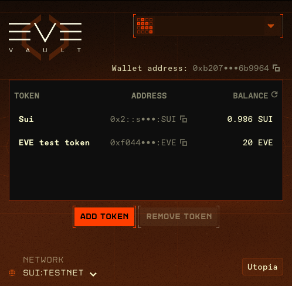
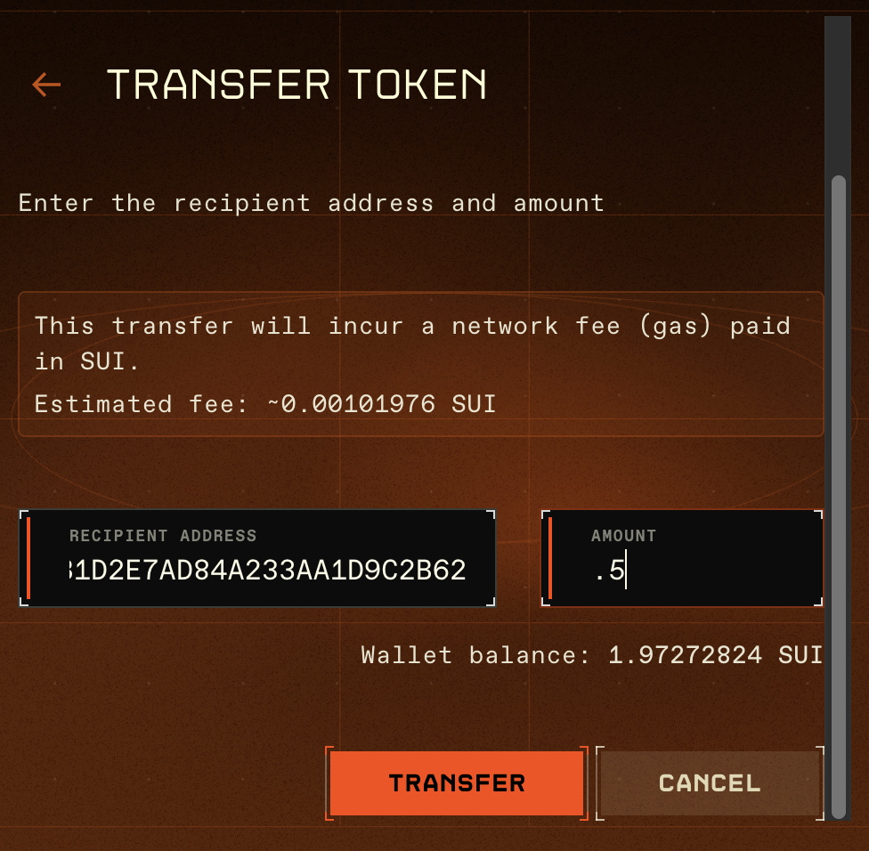
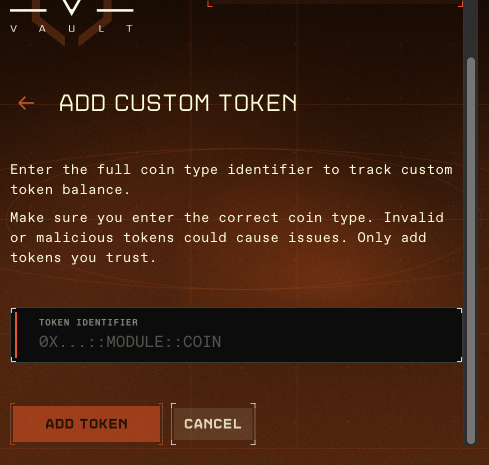
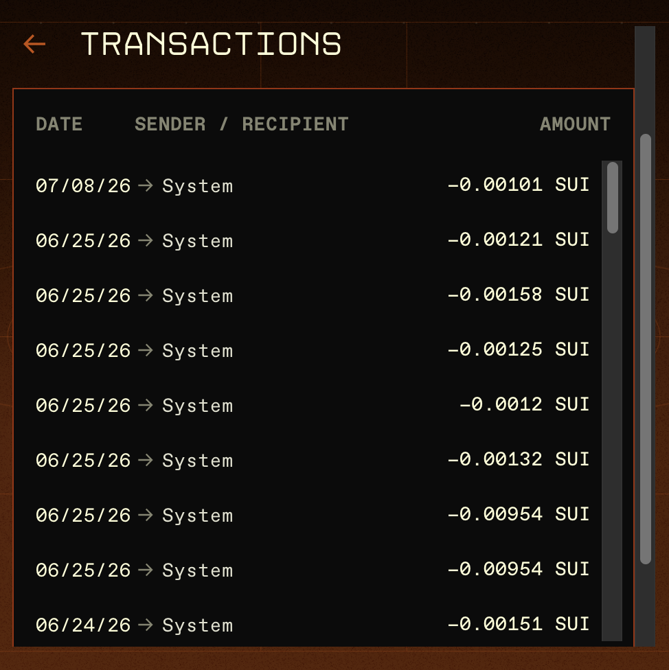

# Using Your Wallet

Once you've [installed EVE Vault and signed in](browser-extension.md), the dashboard is where you view balances, send tokens, track custom assets, review activity, and lock the wallet. This page covers those everyday actions.

> Before you can sign any transaction, EVE Vault requires you to register a personal access key as an address alias. If your first **transfer** opens a recovery-key setup screen, see [Address Aliases & Recovery](address-aliases-and-recovery.md).

---

## The dashboard and token list

The dashboard lists the tokens tracked for the current network in three columns: **TOKEN**, **ADDRESS**, and **BALANCE**.

- Your **wallet address** appears at the top with a **Copy** button — click it to copy the full address.
- Each row shows the token name, a shortened coin type (e.g. `0x1234•••ABCD`) with a copy icon, and your balance.
- If no tokens are tracked yet, you'll see **No tokens added yet**.

### Refreshing balances

The **BALANCE** column header doubles as a **Refresh balances** button. Clicking it updates your balances and recent activity. If a refresh fails, you'll see **Failed to refresh balances**.

### Selecting a token

Click a token row to select it. When a row is selected, a **Transfer** button appears on that row, and the **Remove token** action at the bottom becomes available. Selecting the same row again deselects it. Use the copy icon on a row to copy that token's full coin type.

---

## Send tokens

Start a transfer with the **Transfer** button on a selected token row (or the send action for that token). On the send screen:

1. Enter the **Recipient Address** (a Sui address).
2. Enter the **Amount**. The field accepts numbers only. Your available balance is shown on the right as **Wallet balance: {balance} {symbol}**.
3. Review the fee. Every transfer pays a network fee (gas) in **SUI**, and an estimate appears as **Estimated fee: ~{x} SUI** once the form is valid.
4. Click **transfer**. To cancel, click **cancel**.

### Validation and warnings

EVE Vault checks the form as you type:

- **Invalid Sui address format** — the recipient isn't a valid Sui address.
- **Invalid amount or exceeds balance** — the amount is empty, zero, or larger than your balance.
- System notices also appear for **No network selected**, **Not authenticated**, **Wallet not ready** (locked), **Insufficient balance**, and **No SUI for gas (required for transaction fees)**.

Because gas is paid in SUI, you need a SUI balance even when sending a different token. If your SUI balance is zero on a test network, a **Faucet test SUI** shortcut appears so you can top up (see [Developer & Localnet](developer-and-localnet.md)).

The **transfer** button stays disabled until the network is ready, you're authenticated and unlocked, you have both a token balance and SUI for gas, and the recipient and amount are valid.

### First transfer: recovery-key setup

The **first time** you send (or sign) a transaction, EVE Vault requires a personal access key to be registered as an address alias. Clicking **transfer** opens the recovery-key setup flow; once you complete it, the transfer proceeds. This is a one-time step per account — see [Address Aliases & Recovery](address-aliases-and-recovery.md).

### After sending

On success you'll see a confirmation screen showing the **Amount sent**, **Recipient address**, and **Transaction** digest, with a **View on Suiscan** button to open the transaction in the block explorer, and a **close** button to return to the dashboard.

---

## Add a custom token

To track a token that isn't listed by default, use **Add token** at the bottom of the dashboard. On the **Add custom token** screen:

1. Enter the full coin type in the **Token identifier** field, in the form `0x...::module::COIN`.
2. Click **Add Token** (or **Cancel** to go back).

EVE Vault validates the format and rejects malformed identifiers (**Invalid coin type format. Expected: 0x...::module::COIN or 0x2::Coin<...>**). Adding a token only tracks and displays its balance locally — it performs no on-chain action.

> **Only add tokens you trust.** Invalid or malicious tokens can cause problems. Double-check the coin type before adding it.

To stop tracking a token, select its row on the dashboard and click **Remove token**.

---

## Transaction history

Open **Transaction History** from the account menu to see past activity for your address, in columns **Date**, **Sender / Recipient**, and **Amount**.

- Sent transactions show a minus sign (`−`) before the amount; received transactions don't.
- The counterparty is shown as a shortened address, or **System** when there isn't one.
- Click a row to expand it and see the per-token **balance changes**, the full **Transaction** digest, and a **View on Suiscan** button. Only one row is expanded at a time.
- History loads 50 transactions at a time; click **Load more** to fetch older entries.

Status messages appear when relevant: **Loading transactions...**, **No transactions found**, or **Failed to load transactions**.

---

## Locking, auto-lock, and reset

EVE Vault is protected by a **6-digit PIN** that you create the first time you open it and enter to unlock it afterward.

- **Lock manually** — choose **Lock Wallet** from the account menu.
- **Auto-lock** — the vault locks itself automatically after about 10 minutes. You'll need to re-enter your PIN to continue. (In dev mode, an **Unlock expires in {m:ss}** countdown is shown; see [Developer & Localnet](developer-and-localnet.md).)

### Forgot PIN / reset on this device

If you've forgotten your PIN, use **Forgot PIN** on the lock screen. This opens a confirmation:

> **Reset EVE Vault on this device?** This will reset your PIN and remove all EVE Vault data from this device. Your wallet will be available after you recreate your PIN and sign back in.

Choosing **Reset** wipes device-local data only — your PIN, cached keys and sessions, stored logins, and any custom tokens you added. It does **not** destroy your wallet: because your address is derived from your zkLogin identity, you recover the same wallet by creating a new PIN and signing back in.

> **Note:** Custom tokens you added are cleared by a reset and will need to be re-added.

---

For install and sign-in steps, see [Browser Extension](browser-extension.md). For the concepts behind the wallet and zkLogin, see [Wallets & Identity](wallets-and-identity.md).
