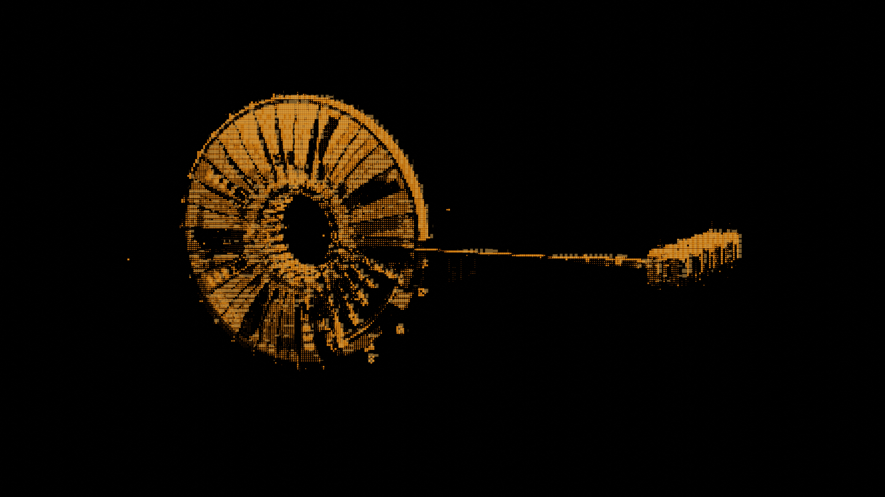

# Gate

<figure><figcaption></figcaption></figure>

## Introduction

A Gate is a structure in space that enables travel between locations. Two gates link together to create a transport route. Gates are **programmable** — the owner can deploy custom extension contracts to control who can jump.

### Default Behavior

By default (no extension configured), **anyone can jump** through the gate without restrictions.

### Custom Behavior (Extension)

When the owner configures an extension, the gate switches to a **permit-based** model:

1. The owner deploys a custom Move contract that defines jump rules
2. The owner registers the contract as the gate's extension using `authorize_extension`
3. Players must obtain a `JumpPermit` from the extension logic before jumping
4. The `jump_with_permit` function validates the permit and allows the jump

```move
public struct JumpPermit has key, store {
    id: UID,
    character_id: ID,
    route_hash: vector<u8>,
    expires_at_timestamp_ms: u64,
}
```

The `route_hash` is direction-agnostic a permit issued for Gate A → Gate B also works for Gate B → Gate A.

For a full working example, see the [Custom Smart Gate Example](https://github.com/evefrontier/builder-scaffold/tree/main/move-contracts/smart_gate).

## Linking Gates

Two gates must be **linked** before anyone can jump between them. Requirements:
- Both gates must be owned by the same character
- Both gates must be online
- Gates must be at least 20km apart (verified with a server-signed distance proof)
- Must be an **authorized sponsored transaction** (validated via `AdminACL`)

## Gate API

Custom contracts use the **typed witness pattern**. Your custom contract defines a witness struct (`Auth`), and the gate verifies its type at runtime.

**Authorize an extension:**

```move
public fun authorize_extension<Auth: drop>(
    gate: &mut Gate,
    owner_cap: &OwnerCap<Gate>,
)
```

**Issue a jump permit:**

```move
public fun issue_jump_permit<Auth: drop>(
    source_gate: &Gate,
    destination_gate: &Gate,
    character: &Character,
    _: Auth,
    expires_at_timestamp_ms: u64,
    ctx: &mut TxContext,
)
```

**Jump with a permit:**

```move
public fun jump_with_permit(
    source_gate: &Gate,
    destination_gate: &Gate,
    character: &Character,
    jump_permit: JumpPermit,
    admin_acl: &AdminACL,
    clock: &Clock,
    ctx: &mut TxContext,
)
```

## Energy & Lifecycle

Gates follow the same energy model as all assemblies:
- Must be connected to a [Network Node](../network-node.md) for energy
- Must be brought **online** (reserves energy) before they can be used
- Going **offline** releases the reserved energy

## Next Steps

Build and test a custom smart gate end-to-end: [Build Guide](./build.md)

**Reference:**
- [`gate.move`](https://github.com/evefrontier/world-contracts/blob/main/contracts/world/sources/assemblies/gate.move) — core gate contract
- [`smart_gate` extension example](https://github.com/evefrontier/builder-scaffold/tree/main/move-contracts/smart_gate/sources) — builder scaffold example
- [`world contracts`](https://github.com/evefrontier/world-contracts/tree/main/contracts/world) — world contract source
