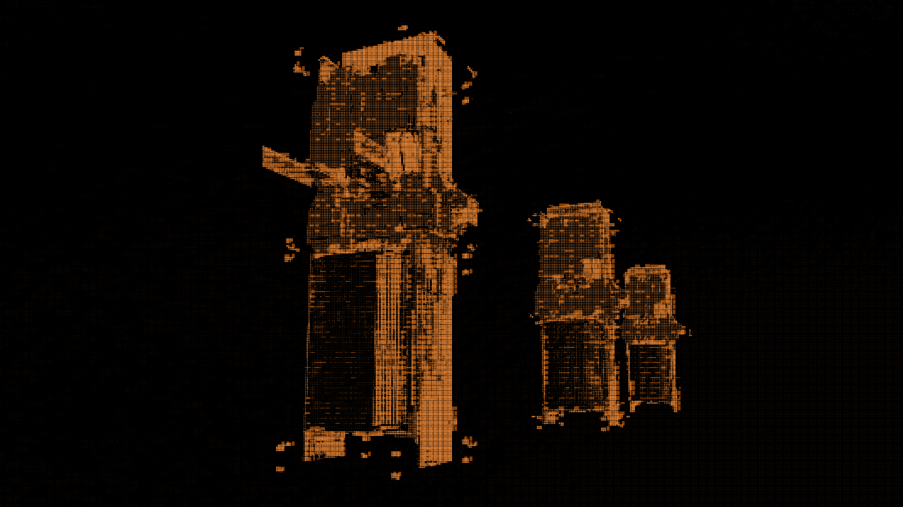

# Storage Unit

<figure><figcaption></figcaption></figure>

## Introduction

The Smart Storage Unit (SSU) is a **programmable, on-chain storage structure**. Players can store, withdraw, and manage items and the owner can define custom rules through extension contracts.

## Design
A storage unit has two types of inventories:

- **Primary inventory** — owned by the storage unit owner, accessed via the storage unit's `OwnerCap`. This is the main inventory for the owner's items.
- **Ephemeral inventories** — temporary, per-character inventories for players other than the owner. Used for trading, deposits, etc. Ephemeral inventories have a smaller capacity than the primary inventory to prevent abuse of the owner's storage unit.

Ephemeral inventories are created on-demand and stored as dynamic fields keyed by the character's `OwnerCap` ID. Each ephemeral inventory is accessed by the interacting character's own `OwnerCap`, like biometric authentication for temporary access. This avoids minting separate `OwnerCap`s just for ephemeral inventory access.

Items in inventories are on-chain representations of in-game resources.

## Interacting with a Storage Unit

### 1. Bridging Items (Game to Chain)

For any on-chain interaction, items must first be available on-chain. Players deposit items from in-game to the chain, and can withdraw them back to the game.

- **Game → Chain** (`game_item_to_chain_inventory`) — mints on-chain items from in-game data
- **Chain → Game** (`chain_item_to_game_inventory`) — burns on-chain items and returns them to the game (requires proximity proof)

### 2. On-Chain Deposit & Withdraw

Once items are on-chain, the owner can deposit and withdraw directly using their `OwnerCap`. Currently requires an **authorized sponsored transaction** (validated via `AdminACL`) as a temporary access check. This will be replaced with a proximity proof once a location service is available for signed server proofs. Since these are public functions, the owner can call them directly from a dApp via [Programmable Transaction Blocks](https://docs.sui.io/concepts/transactions/prog-txn-blocks) — no custom contract required.

```move
public fun deposit_by_owner<T: key>(
    storage_unit: &mut StorageUnit,
    item: Item,
    character: &Character,
    admin_acl: &AdminACL,
    owner_cap: &OwnerCap<T>,
    ctx: &mut TxContext,
)

public fun withdraw_by_owner<T: key>(
    storage_unit: &mut StorageUnit,
    character: &Character,
    admin_acl: &AdminACL,
    owner_cap: &OwnerCap<T>,
    type_id: u64,
    ctx: &mut TxContext,
): Item
```

### 3. Custom Logic via Extensions

Players can build intersting use cases by deploying custom contracts. The extension uses the **typed witness pattern** — same as the [Gate extension pattern](../gate/README.md#extension-pattern).

**Authorize the extension:**

```move
public fun authorize_extension<Auth: drop>(
    storage_unit: &mut StorageUnit,
    owner_cap: &OwnerCap<StorageUnit>,
)
```

Once authorized, the custom contract can call `deposit_item` / `withdraw_item` using its `Auth` witness:

```move
public fun deposit_item<Auth: drop>(
    storage_unit: &mut StorageUnit,
    character: &Character,
    item: Item,
    _: Auth,
    _: &mut TxContext,
)

public fun withdraw_item<Auth: drop>(
    storage_unit: &mut StorageUnit,
    character: &Character,
    _: Auth,
    type_id: u64,
    _: &mut TxContext,
): Item
```

**Example: Vending Machine**

```move
module custom::vending_machine;

public struct VendingAuth has drop {}

public fun buy_item(
    storage_unit: &mut StorageUnit,
    character: &Character,
    payment: Coin<SUI>,
    type_id: u64,
    ctx: &mut TxContext,
): Item {
    // Custom logic: verify payment, check inventory, etc.
    // ...

    storage_unit::withdraw_item(
        storage_unit,
        character,
        VendingAuth {},
        type_id,
        ctx,
    )
}
```

**Reference:**
- [`storage_unit.move`](https://github.com/evefrontier/world-contracts/blob/main/contracts/world/sources/assemblies/storage_unit.move)
- [`inventory.move`](https://github.com/evefrontier/world-contracts/blob/main/contracts/world/sources/primitives/inventory.move)
